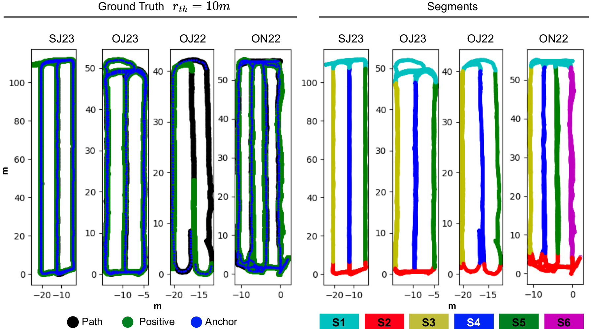

# PointNetGAP: A lightweight 3D LiDAR-based place recognition for mobile robot navigation in horticulture

### Authors:  T. Barros, L. Garrote, P. Conde, M.J. Coombes, C. Liu, C. Premebida, U.J. Nunes


# Installation

You can install PointNetGAP locally in your machine.  We provide an complete installation guide for conda.


1. Create conda environment with python: ``` conda create -n pr_env python=3.9.4 ```

2. Activate conda environment
```  conda activate pr_env ```

3. Install cuda 11.7.0 ``` conda install -c "nvidia/label/cuda-11.7.0" cuda-toolkit    ```

4. Install Pytorch 2.0.1 ``` conda install pytorch==2.0.1 torchvision==0.15.2 torchaudio==2.0.2 pytorch-cuda=11.7 -c pytorch -c nvidia ```

5. Testing installation ``` .... ```

6. Install sparse ``` pip install --upgrade git+https://github.com/mit-han-lab/torchsparse.git@v1.4.0 ```

7. Install other dependencies  ``` pip install -r requirements.txt```


# HORTO-3DLM Dataset

The HORTO-3DLM dataset comprises four sequences OJ22, OJ23, ON22, and SJ23;  Three sequences from orchards, namely from apples and cherries; and one sequence from strawberries;


### 3D Maps 
[Download HORTO-3DLM here](https://nas-greenbotics.isr.uc.pt/drive/d/s/x4eZ5aPL96blS0i7xNKIl0iJOtkdU7QR/h3YJb7wuqCZpV9NNxgeITnGTRsDJeVNY-a7eAQXUnGQs#file_id=799704328662196403)


### Segments and loop ground truth



# Training 


# Evaluation


[Download Pre-Trained models here](
https://nas-greenbotics.isr.uc.pt/drive/d/f/x4ej2UQyCu1pJzyOPXxHfDZXD2W9gOqh)


### Triplet Ground Truth: 

Pre-generated triplet files: 
A loop exists (ie anchor-positive pair) whenever  two samples from different revisits are within a range of 2 meters;

For each anchor, exists: 
 - 1 positive, nearest neigbor within a range of 2 meters,
 - 20 negatives, selected from outside a range of 10 meters,

For the purpose of this work, 4 pre-defined triplet data where generated  and stored in the pickled files.
The files names incode information regarding the selection process of the data. 
E.g., the file "ground_truth_ar0.1m_nr10m_pr2m.pkle" comprises anchors (ar) are sperated by at least 0.1m.
the negatives where generated from outside a range of 10m and the positive was selected whithin a range of 2m.

The four predefined triplet data files are the following:
 - ground_truth_ar0.1m_nr10m_pr2m.pkle
 - ground_truth_ar0.5m_nr10m_pr2m.pkle
 - ground_truth_ar1m_nr10m_pr2m.pkle
 - ground_truth_ar5m_nr10m_pr2m.pkle

## Number of anchor positive pairs (ie loops):
The following information represents the number of loops that exist for each ground truth file. The number of loops also correspond to the number of training samples in each file. 

Orchards/aut22:\
AR5.0m: 45
AR1.0m: 252
AR0.5m: 495
AR0.1m: 1643

Orchards/sum22:
AR5.0m: 10
AR1.0m: 53
AR0.5m: 100
AR0.1m: 391

Orchards/june23:
AR5.0m: 54
AR1.0m: 268
AR0.5m: 512
AR0.1m: 1982

Strawberry/june23:
AR5.0m: 66
AR1.0m: 311
AR0.5m: 598
AR0.1m: 1942

greenhouse/e3:
AR5.0m: 14
AR1.0m: 73
AR0.5m: 117
AR0.1m: 242
